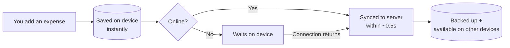
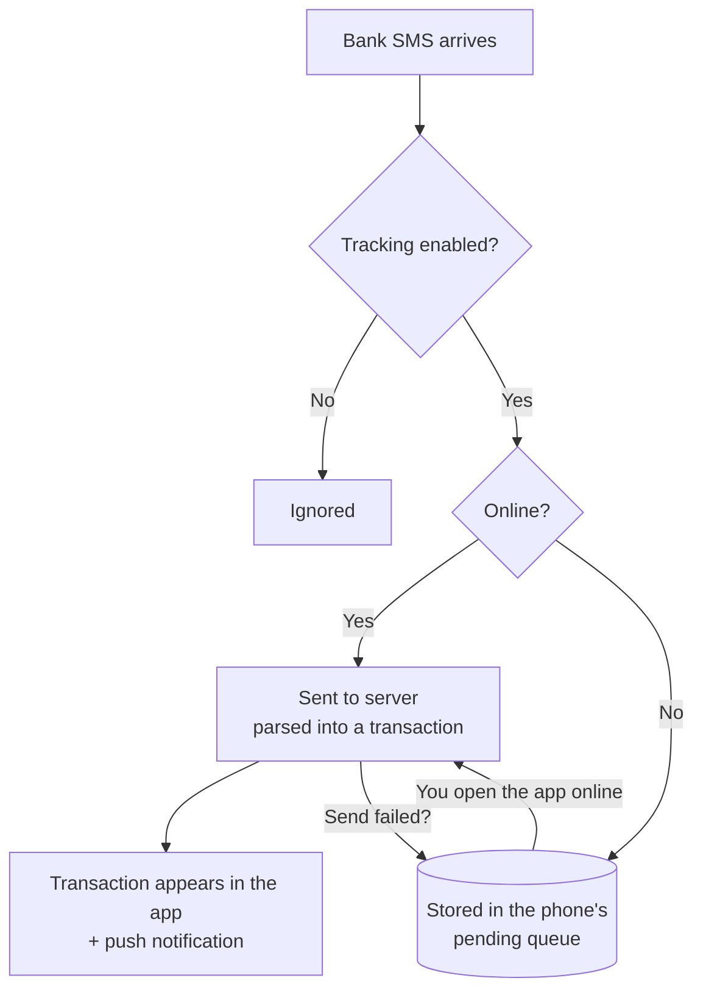
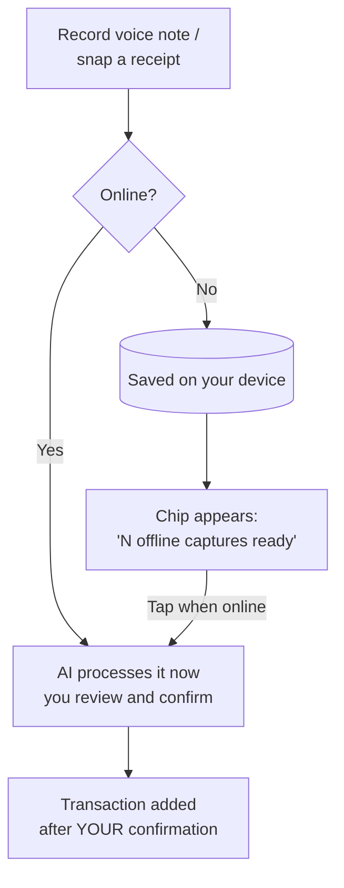

# Buddget Offline Guide (for beginners)

Buddget is **offline-first**: your data lives on your device, and the internet is only used to back it up and sync it across devices. You can open the app, log expenses, and check your budget with zero connection — you shouldn't even notice you're offline.

## The golden rule

> **Your device is the source of truth. The server is the backup.**
> Everything you do offline is saved instantly on the device and synced automatically the moment you're back online.

## What works offline?

| Feature | Offline? | What happens |
|---|---|---|
| View expenses, income, savings, debts, budgets, goals | ✅ Fully | Read from the device cache — instant |
| Add / edit / delete anything | ✅ Fully | Saved locally, queued, auto-synced later |
| Change settings, theme, currency | ✅ Fully | Same as above |
| SMS auto-tracking | ✅ Queued | SMS is captured and stored on the phone; sent to the server when online |
| Receipt camera scan | ✅ Queued | Photo saved on device; a chip appears to finish the scan when online |
| Voice expense | ✅ Queued | Recording saved on device; processed via the chip when online |
| Buddgy AI chat | ❌ Needs internet | Shows a friendly notice; your data stays viewable |

## How your data flows

- Every change is written to the device first — the app never waits for the network.
- When the connection returns, Buddget automatically pushes your offline changes **and** pulls anything new from your other devices, in the background, with no loading screens.
- If the same item was edited on two devices, the **newest edit wins**.

## How SMS tracking survives offline

- The phone keeps a **pending queue** (up to 50 messages). Nothing is lost if you're offline, the app is closed, or the server hiccups.
- Settings → SMS Auto-Tracking shows "N messages waiting to sync" whenever the queue isn't empty.
- Sending the same SMS twice is harmless — the server recognizes duplicates.

## How voice & receipt captures work offline

Nothing is ever added to your budget without your review — the chip just resumes exactly where you left off.

## Opening the app offline

1. Splash shows for about 1.5 seconds.
2. Your cached data appears immediately — no spinners, no skeletons.
3. A slim amber "You're offline" banner is the only hint.
4. When connection returns, everything syncs silently in the background.

## FAQ

**Do I lose data if I force-close the app while offline?**
No. Every change is written to device storage the moment you make it.

**What if my phone dies before syncing?**
Your data is still on the phone; it syncs on the next app open with internet.

**Why does Buddgy not work offline?**
Buddgy is a cloud AI model — it needs the internet to think. Everything it would tell you about (your numbers) is still available offline.

**Do SMS arrive while the app is killed?**
Yes (Android): the system hands the SMS to Buddget's background worker even when the app is closed. If there's no internet, it's queued on the phone.
