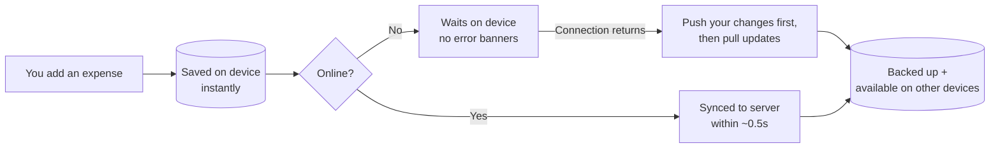
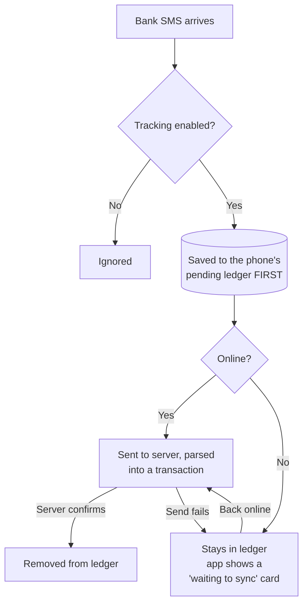
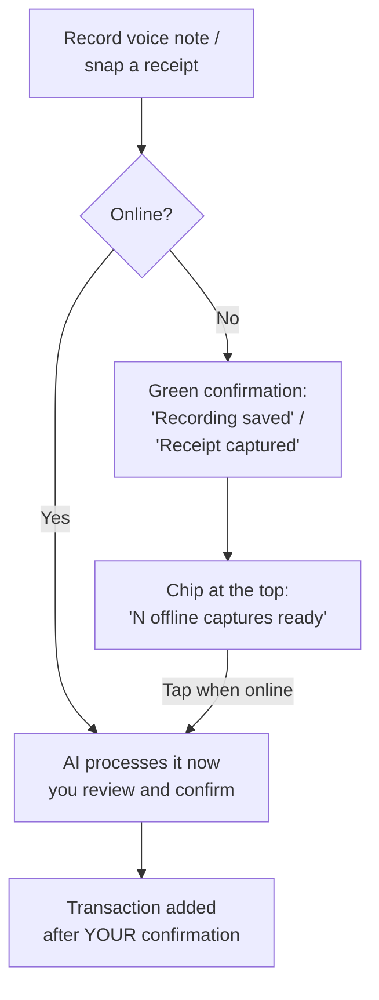

# Buddget Offline Guide (for beginners)

Buddget is **offline-first**: your data lives on your device, and the internet is only used to back it up and sync it across devices. You can open the app, log expenses, and check your budget with zero connection — you shouldn't even notice you're offline.

## The golden rule

> **Your device is the source of truth. The server is the backup.**
> Everything you do offline is saved instantly on the device and synced automatically the moment you're back online. Nothing is ever lost to a bad connection.

## What works offline?

| Feature | Offline? | What happens |
|---|---|---|
| View expenses, income, savings, debts, budgets, goals | ✅ Fully | Read from the device cache — instant |
| Add / edit / delete anything | ✅ Fully | Saved locally, queued, auto-synced later |
| Change settings, theme, currency | ✅ Fully | Same as above |
| SMS auto-tracking | ✅ Queued + visible | SMS kept on the phone; **"waiting to sync" cards** show it in the app right away |
| Receipt camera scan | ✅ Queued | "Receipt captured" confirmation; finish via the chip when online |
| Voice expense | ✅ Queued | "Recording saved" confirmation; finish via the chip when online |
| Buddgy AI chat | ❌ Needs internet | Friendly notice, send disabled; your data stays viewable |

## How your data flows

- Every change is written to the device first — the app never waits for the network.
- On reconnect, Buddget **pushes your offline changes first, then pulls** what's new from your other devices. This order guarantees an expense you deleted offline stays deleted, and a setting you changed offline sticks.
- If the same item was edited on two devices, the newest edit wins.
- While offline you'll never see sync-error warnings for normal edits — the app knows it's offline and simply waits.

## How SMS tracking survives offline

Every captured SMS goes into an on-device **ledger first**, and is only removed after the server confirms it was received. That means:

- **You see it immediately.** Recognized bank messages (CIB, HSBC, NBE, Vodafone Cash, and more) appear as dashed *"Waiting to sync — will be added automatically"* cards **with the real amount and merchant**, parsed right on your phone. Other messages show as "Bank SMS captured." The cards disappear on their own once the real transaction syncs in.
- **Nothing can be lost.** Closed app, dead network, server hiccup, expired session, daily AI limit reached, even the app being killed mid-sync — the message stays safely in the ledger and is retried on the next app open or reconnect.
- Settings → SMS Auto-Tracking shows "N messages waiting to sync" whenever the ledger isn't empty.
- Duplicates are impossible: the server recognizes a message it has already processed.

## Voice notes & receipt scans offline

- Capturing works offline; only the AI processing needs internet. You get a clear green confirmation the moment your capture is saved.
- When you're back online, a chip appears at the top of the app. Tapping it resumes exactly where you left off: receipts re-open the scan review with your photo, voice notes are transcribed into the Buddgy chat for confirmation.
- Nothing is ever added to your budget without your review.
- **Privacy:** offline captures belong to you — signing out wipes the queue and all saved audio/photos, so nothing carries over to another account on a shared device.

## Opening the app offline

1. Splash shows for about 1.5 seconds.
2. Your data appears immediately — no spinners, no skeletons.
3. A slim amber "You're offline" banner is the only hint.
4. When connection returns, everything syncs silently in the background — pending SMS, offline edits, and market rates included.

## FAQ

**Do I lose data if I force-close the app while offline?**
No. Every change — including captured SMS, voice notes, and receipt photos — is written to device storage the moment it happens.

**What if the sync itself gets interrupted?**
Nothing is lost. Queued items are only removed after the server confirms each one, so an interrupted sync simply resumes next time.

**I deleted an expense offline. Can it come back after syncing?**
No. Your offline changes are pushed to the server *before* anything is pulled down, so deletes and edits always win.

**Why doesn't Buddgy work offline?**
Buddgy is a cloud AI model — it needs the internet to think. Everything it would tell you about (your numbers) is still available offline.

**Do SMS arrive while the app is killed?**
Yes (Android): the system hands the SMS to Buddget's background worker even when the app is closed. Without internet it's saved to the ledger on your phone.

**What if I disable SMS tracking while messages are still waiting?**
They're not stranded — already-captured messages are still delivered on your next online app open.
